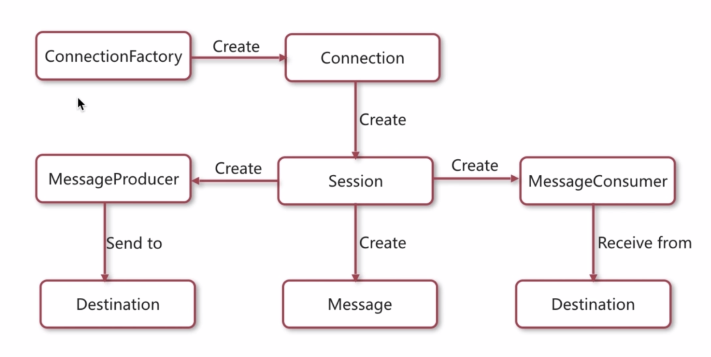
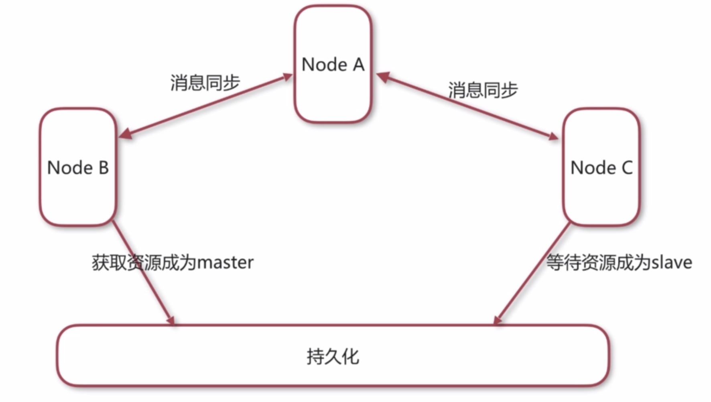
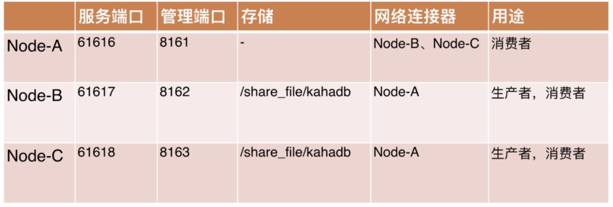

# activemq
消息队列的学习项目

## 安装

### 安装环境
```
wget 网址
tar -xzvf 文件名
cp 文件名 /usr/local/
```

### 测试
```
cd /usr/local/文件名/bin/
./activemq start
```
项目默认管理地址：*8161*


## JMS
一个Java平台中关于面向消息中间件（MOM）的API


### 模式
- 队列模式 queue
- 主题模式 topic


## 集群

###概念

#### 集群目的
- 高可用 派出单点故障引起的服务中断(一个挂掉，另一个立即顶上，消息不丢失)
- 负载均衡 以提升效率为更多的客户服务（压力不用集中在一个节点上）

#### 集群方式
- 客户端集群：让多个消费者同步一个队列
- Broke cluster：多个broker之前同步消息 消息不在一个地方储存 实现负载均衡
- Master Slave：实现高可用  (zookKeeper实现)

### 某种达到负载均衡和高可用的办法

#### 方案
- A可以用用来消费



#### 具体代码
- activemq.xml

```
<networkConnectors>
    <networkConnector name="local_network" uri="static:(tcp://127.0.0.1:61617,tcp://127.0.0.1:61618)"/>
</networkConnectors>

```
- jetty.xml需要修改端口

- 重用命令
```
ps -ef | grep activemq
netstat -an | grep 61618
```
-命令行测试
```
    private static final String url = "failover:(tcp://127.0.0.1:61617,tcp://127.0.0.1:61618)?randomize=true";
    private static final String url2 = "failover:(tcp://127.0.0.1:61616,tcp://127.0.0.1:61617,tcp://127.0.0.1:61618)?randomize=true";
```

